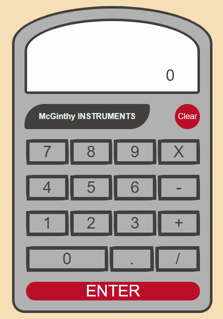

# Calculator

This project was designed to help me learn how to use jQuery to build the functionality of a calculator. It will function just like a standard calculator when complete.

## Description

This is a JavaScript web application that allows the user to leverage a calculator interface to process simple mathmatical calculations. The calculator will add, subtract, multiply, and divide and show you the result of each calculation. 

## Link to Site

https://codragon2020.github.io/calculator/

This site was made with:

## Screenshots

